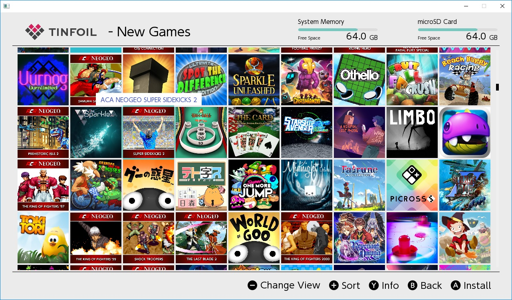
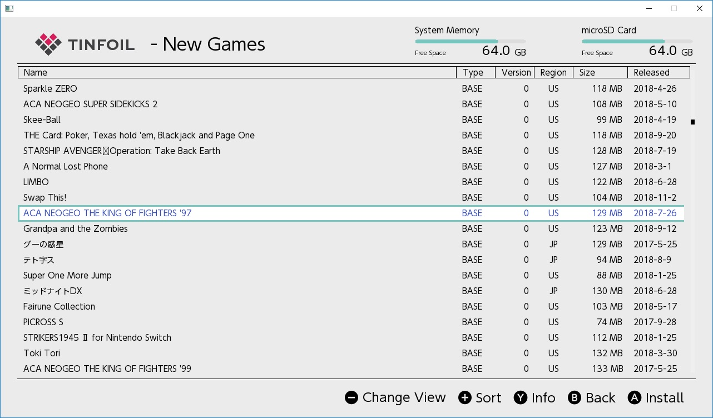
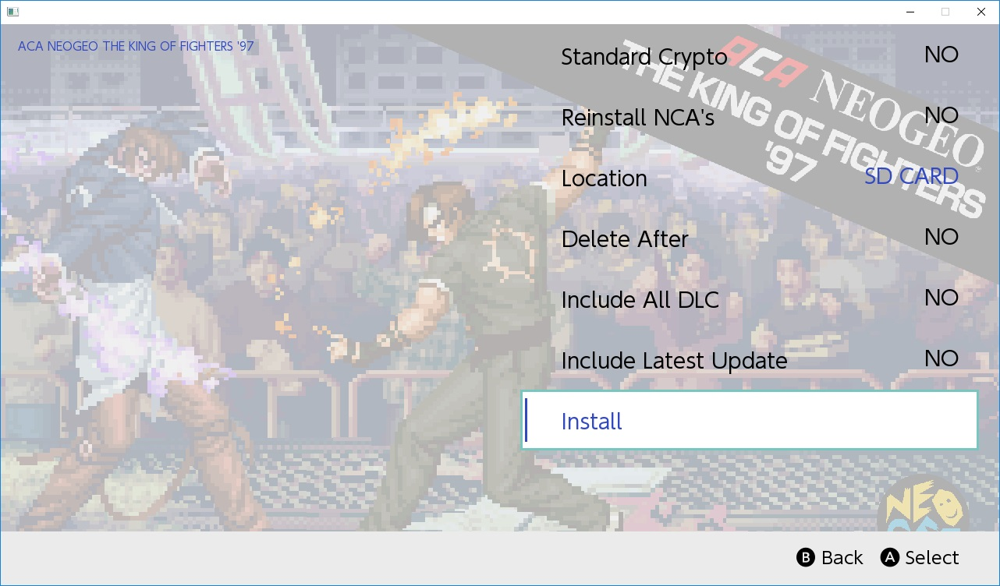

# Tinfoil

홈브류 게임, 업데이트, DLC 설치 프로그램.  https://tinfoil.io/ 에서 다운로드 하십시오.

## 스크린샷

## 설치

 - 스위치의 SD 카드에 `/switch/tinfoil/` 디렉토리를 생성합니다.
 - `tinfoil.nro`를 `/switch/tinfoil/tinfoil.nro`에 복사하십시오.
 - Obtain or generate a `keys.txt` file and place it in `/switch/tinfoil/keys.txt`. `keys.txt` is a text file containing various Switch encryption keys. If you plan to generate it yourself, you can find instructions here:  https://gbatemp.net/threads/how-to-get-switch-keys-for-hactool-xci-decrypting.506978/ or use [`Lockpick`](https://github.com/shchmue/Lockpick)
 - `keys.txt` 파일을 구하거나 생성하여 `/switch/tinfoil/keys.txt`에 저장하십시오. `keys.txt`는 다양한 스위치 암호화 키가 들어있는 텍스트 파일입니다. 직접 생성하려면 https://gbatemp.net/threads/how-to-get-switch-keys-for-hactool-xci-decrypting.506978/에서 지침을 참조하거나 Lockpick을 사용하십시오.

## 지원 프로토콜

#### SD 카드
로컬 SD 카드에서 설치를 지원합니다. SD 카드를 지정하려면 URI `sdmc:/`를 사용하십시오. 예를 들어, `sdmc://nsps/`와 같이 하위 디렉토리도 작동합니다.

#### FTP
일반적인 FTP 프로토콜. FTPS는 표준 FTP 프로토콜을 지원하지 않으며 SFTP는 지원하지 않습니다.

#### HTTP
HTTP를 사용하려면 디렉토리 listing / browsing가 활성화되어 있어야 합니다.

#### SX USB Mass 저장 장치 / 하드 드라이브
SX OS 2.2.1 이상이 필요합니다. Tinfoil을 시작하기 전에 하드 드라이브를 연결하십시오. Tinfoil은 자동적으로 루트 디렉토리를 스캔 할 것이고 어느 서브 디렉토리든 locations.conf에 추가해야 합니다. 현재 핫 스왑을 지원하지 않습니다.

#### USB
구성된 `nut` 서버가 필요합니다. 자세한 내용은 [여기](https://github.com/blawar/nut/#usb-server-for-dz) 를 참조하십시오.

#### NUT 서버
구성된 `nut` 서버가 필요합니다. 자세한 내용은 [여기](https://github.com/blawar/nut/#server-gui) 를 참조하십시오. 항상 Tinfoil을 사용하여 최신 NUT 서버를 실행하고 있는지 확인하십시오.

## 문제 해결

#### 네트워크 위치가 표시되지만 나열된 파일이 없습니다.
Tinfoil은 제공된 네트워크 설정에 연결할 수 없으며 http를 사용하고 디렉토리 검색을 활성화하지 않았으므로 방화벽이 연결을 차단합니다.
- 서버를 실행하는 PC와 *다른* PC에서 제공된 설정을 사용하여 FTP/HTTP/NUT 서버에 연결할 수 있는지 확인하십시오.
- Tinfoil은 하위 디렉토리를 지원하지 않으므로 각 디렉토리는 NSP가 있는 정확한 디렉토리를 가리켜야 합니다.
- 방화벽이 외부 연결을 허용하는지 확인하십시오. 방화벽을 구성하거나 비활성화하십시오.
- HTTP를 사용하는 경우, 디렉토리 listing / browsing가 사용 가능한지 확인하십시오. IIS에서 수동으로 활성화해야 합니다.

#### 파일을 볼 수는 있지만 다운로드 할 수는 없습니다.
- HTTP를 사용하는 경우 웹 브라우저를 사용하여 파일을 다운로드 할 수 있는지 확인하십시오. IIS를 다운로드하기 전에 NSP (응용 프로그램/octet-stream)에 MIME 형식을 추가해야 합니다.

#### Tinfoil이 시작될 때 응답하지 않습니다.
부팅시 PC에 스위치를 연결했으면 USB Nut 서버가 실행되지 않고 USB의 Tinfoil 블록이 대기합니다.

## 면책조항

자신의 책임하에 사용하고, [항상 NAND 백업을하십시오.](https://gbatemp.net/threads/rcm-payload-hekate-ctcaer-mod.502604/).

## 추가 정보

## 자주하는 질문

#### 왼쪽의 각 아이콘은 무엇을 의미합니까?
왼쪽에는 스위치에 아직 설치되지 않았지만 PC(게임 컨트롤러)에 있는 아이콘과 PC/서버 (PC 아이콘)에 있는 아이콘이 표시됩니다. 게임, DLC, 업데이트 아래에 게임 제어기 아이콘이 표시된 항목은 현재 PC에 있지만 스위치에는 없습니다.
홈 탭으로 이동하여 스위치에 설치한 모든 것을 볼 수 있습니다.

# 변경이력

- 네트워크 문제를 해결하기 위해 콘솔 창에 CURL 오류 로깅 추가.
- 백만 개의 위치를 추가하는 영혼을 위해 스크롤 막대를 메뉴에 추가.
- 완성된 대기열 항목에 색칠된 배경 추가.
- 0x1000 / 65536 이상의 업데이트 설치 문제 해결.
- 콘솔에 스크롤바 추가
- 페페 아이콘 삭제.
- 마이너 스크롤 막대 그래픽 결함 수정.
- "'" 및 "&"의 명명 문제 수정.
- 게임에 추가 된 아이콘/바둑판 식 레이아웃 옵션 및 전환 가능한 보기.
- 패널을 탐색할 때 접을 수 있는 메뉴 추가.
- 약간의 메모리 누수 수정.
- 설치에 대한 시스템 버전 확인 제거.
- OS를 통해 확인할 때 데이터 손상 오류 수정.
- UI 아이콘의 성능 최적화.
- 특정 제목을 설치하는 동안 메모리 문제 해결.
- 특정 파일 형식의 최적화 된 열기.
- 다운로드 속도 조금 향상.
- DLC 및 업데이트 아이콘 추가.
- 소형 DLC 다운로드 문제 해결.
- 응용 프로그램 레코드를 삭제하기 위한 창 추가.
- UI 트윅
- 네트워크 디렉토리에 대한 정렬 추가.
- FTP 위치에 대한 파일 크기 및 수정 날짜 추가.
- 여유 공간 표시기 추가.
- 진행률 막대를 이동하여 중지.
- 제목 목록에 버전 및 언어를 추가하고 이름 지움.
- 느린 SD 카드 때문에 마지막 커밋에서 설치 실패 초기 버그 수정.
- 작은 DLC 설치 수정
- SD 설치를 위한 예제 위치 추가
- NAND 설치 옵션 추가
- Nut 서버 지원 추가
- 타일 모드 네비게이션의 작동 수정.
- 느린 SD 카드를 사용하는 사람들의 쓰기 제한 시간 증가.
- 설치된 응용 프로그램을 맨 위로 옮김.
- 전체 NCA가 다운로드되지 않은 경우 오류 메시지 추가.
- 일부 SD 설치가 실패하는 버그 수정.
- 설치 후 여유 공간 새로 고침 추가.
- 정렬 시작 추가. 아직도 버그가 있으니 보고하지 마시오.
- 대화 상자에 조명 상자 추가.
- 아이콘 로딩 크게 향상.
- 응용 프로그램 홈 화면 아이콘 로딩 수정.
- 추가된 설치 옵션. 현재 위치 및 includeDlc 만 작동.
- USB 실험 설치 추가. 서버 명령 (nut가 NSP를 볼 수 있는지 확인하십시오): `nut.py --usb`
- 추가된 제목 유형 열과 지역 열은 이제 NUT 서버로 채워짐.
- DLC 정보를 이름에 다시 추가하여 목록에서 구분할 수 있음.
- 더 부드러운 타일 스크롤 추가.
- 게임, dlc, 업데이트에 대한 자동 병합된 목록을 추가하고 이미 설치 한 타이틀을 숨깁니다. 이 섹션은 모든 위치의 모든 제목을 하나의 고유한 목록으로 병합합니다.
- 병합된 업데이트 섹션에는 설치된 것보다 높은 업데이트 만 표시.
- DLC 및 설치 대화 상자의 업데이트 목록 추가.
- 설치 대화 상자의 최신 업데이트가 이제 작동.
- titles.US.en.json을 로드하여 모든 제목의 이름 / 메타 데이터를 로드하도록 지원 추가. 이 파일을 /switch/tinfoil/titles.US.en.json에 넣으십시오.
- "수정된 날짜"는 이제 "릴리스 날짜".
- 이름이 Tinfoil로 변경.
- b-버튼 종료 비활성화.
- "알 수 없음" 이름 표시 수정.
- 향상된 아이콘 로딩 성능.
- 작은 아이콘 모드 추가.
- 일반 목록에 부드러운 스크롤 기능 추가.
- 새로운 그래픽 결함 수정.
- 제목에 섹션 이름 추가.
- 어두운 테마 재사용 설정.
- b-버튼 종료 수정.
- UI 표시 버그 수정
- NSP에서 읽기 전에 웹에서 미리보기 이미지를 다운로드 할 수 있음.
- 일반 UI 향상.
- 향상된 인터넷 네트워크 성능.
- 이제 호스트 이름은 위치에서 작동해야합니다.
- 읽기 전용 파일 브라우저 추가. 시간이 지남에 따라 기능 추가.
- 메뉴에서 개별 위치 제거. NSP는 파일 브라우저의 위치에서 설치할 수 있음.
- 망가진 USB 설치 수정.
- 게임, dlc, 업데이트에 설치된 타이틀을 표시하는 기능 추가.
- 그리드 UI에서 일부 탐색 단락 수정.
- SX USB 대용량 저장 장치에 대한 지원 추가. Tinfoil은 기본적으로 루트 디렉토리를 스캔하고, 다른 디렉토리는 locations.conf에 추가해야 합니다. 이것이 sx가 아닌 OS에서 충돌할 지 확실하지 않습니다.
- 추가된 메타 데이터 로드 (이미지 및 설명). /switch/tinfoil/db/에 적절한 titles.XX.yy.json이 있어야 함.
- 옵션에 메타 데이터 번역 추가.
- 능률적인 제목 대화 상자, 설치 대화 상자 등.
- NCA 재설치 옵션 추가
- SXUSB 우선 순위 수정되어서 그것은 선호하는 설치 위치임.
- 때때로 기본 포트가 올바르지 않은 문제 수정.
- 로딩 화면 추가.
- 아이콘을 비활성화하여 정크 NSP가 충돌하는 문제 수정.
- 보기 상태를 재설정하는 추가 새로 고침 수정.
- 감소된 메모리 소비.
- GPU 렌더링으로 전환.
- 향상된 아이콘 로딩 성능.
- 화상 키보드 추가.
- 텍스트 검색 / 필터 추가.
- 지역 필터 추가.
- 일반 UI 향상.
- 게임 목록보기 상태 (목록/격자보기, 정렬)를 기억.
- 플레이어 수, 콘텐츠 등급, 장르별 필터링 추가.
- 사용자의 안전을 위해 Tinfoil은 이제 NCA 확인을 시행하므로 잠재적인 악성 코드 실행을 방지하기 위해 Tinfoil은 더 이상 수정된 NCA를 설치하지 않습니다. 즉, Tinfoil을 사용하여 홈브류 NSP 또는 XCI -> NSP 변환 프로그램을 설치할 수 없습니다.
- 새로운 로고 추가.
- 테마 선택기 추가.
- SD에서 일부 파일에 액세스하는 버그 수정.
- 랜덤 UI 요소 수정.
- 네트워크 시간 초과가 줄어듬.
- 인터넷에서 최신 메타 데이터를 다운로드 할 수 있는 기능 추가.
- UI 번역 추가.
- 일반적인 UI 개선.
- 더 많은 기본 스캔 위치 추가.
- 일부 아시아 문자 글꼴 렌더링 문제 수정.
- 스위치가 비영어권으로 설정된 경우 아시아 언어 수정.
- 역순 정렬 추가.
- 설치 중에 수면모드 비활성화 (WAIN에게 감사)
- 홈 버튼 블록 제거.
- 손상을 방지하기 위해 파일을 작성하기 전에 json 파일 삭제.
- 일반적인 UI 개선.
- 홈브류 titleid 마스크 05XXXXXXXXXXY000 추가. 여기서 Y는 짝수. Nro2Nsp를 사용하십시오.
- 일반 UI 향상.
- 응용 프로그램이 제대로 설치되지 않은 경우 자동으로 더 많은 디렉토리 생성.
- UI 속도 향상.
- 향상된 텍스트 렌더링 및 게임 설명에 추가된 스크롤바.
- 파일 브라우저에서 삭제할 수 있는 기능 추가 (모든 위치에서 삭제 기능을 지원하지는 않음).
- 파일 브라우저에서 붙여넣기를 복사할 수 있는 기능 추가 (모든 위치에서 쓰기를 지원하지는 않음).
- 네트워크 연결 시간 제한을 설정하는 옵션 추가.
- 자동 데이터베이스 다운로드를 건너뛰는 옵션 추가.
- 기타 GUI 향상.
- 서명되지 않은 코드를 설치하는 옵션 추가..
- 일부 업데이트 / dlc가 표시되지 않는 문제 수정.
- 키보드에 더 많은 키 추가
- locations.conf 대신 GUI에서 위치를 추가 및 삭제하는 기능 추가.
- URL을 화면에 표시할 때 검열된 암호
- 랜덤 GUI 수정.
- UI 및 설치를 위한 오버 클럭 옵션 추가
- 파일 브라우저 복사 진행률 표시 줄 수정.
- 테마 지원 추가.
- 일반 UI 향상.
- 메타 이미지를 미리 로드하는 기능 추가.
- 파일 시스템보다는 이미지 데이터베이스에 모든 이미지를 저장하기 시작.
- 앱이 인터넷에서 다운로드 될 때 인터넷 아이콘이 켜짐.
- SD 카드에 기록할 때 SD 아이콘이 켜집니다 (켜져있는 동안 홈 버튼을 누르면 손상될 가능성이 높음).
- ~25 번 설치 후 스위치가 다운되는 버그 수정.
- 모든 옵션 설치 추가.
- "설치 후 삭제" 수정
- "Incomplete" 섹션 추가. NCA가 없는 제목을 나열하므로 모두 설치하면 쉽게 다시 설치할 수 있음.
- /switch/tinfoil/tinfoil.nro에서 /switch/tinfoil/tinfoil.nro로 경로 변경

## 크레딧

Adubbz 아이디어:
https://github.com/Adubbz/

HACTOOL 소스 코드는 리버스 엔지니어링되었으며 여기 저기 작은 코드가 들어 있습니다:
https://github.com/SciresM/hactool

랜덤 JSON 파서:
https://github.com/nlohmann/json

## 등록상표

이름 "Tinfoil"은 등록 상표이며 명시적 허가없이 사용될 수 없습니다.
